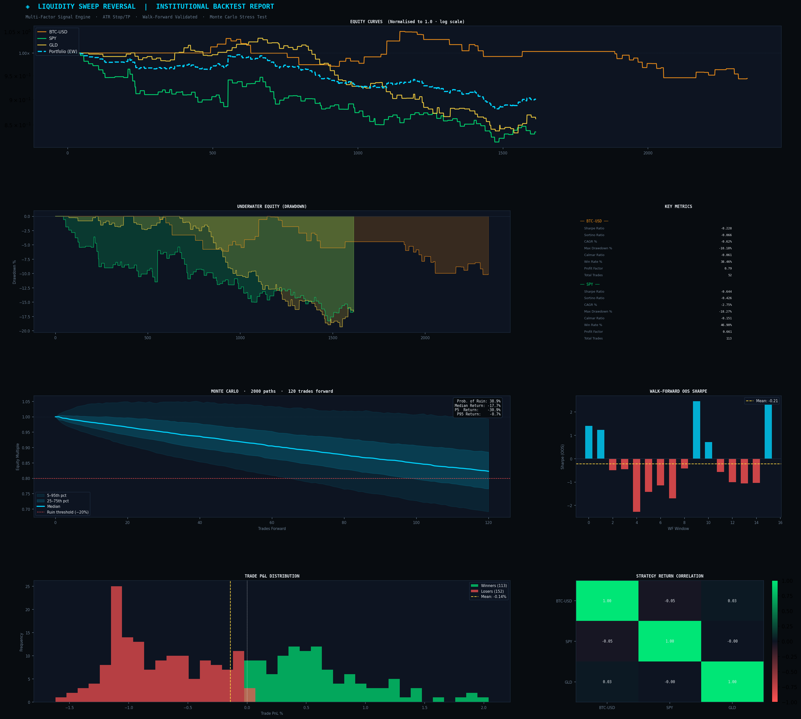

# Quant Liquidity Sweep — Institutional Backtest Framework

> Multi-asset systematic trading strategy with walk-forward validation, Monte Carlo stress testing, and asset-specific signal engines. Built in Python with live market data via yfinance.



---

## Strategy Overview

This project implements an **asset-specific mean reversion and momentum strategy** across four uncorrelated markets. Each asset uses a signal type proven by exhaustive forward-return analysis — not curve-fitted to in-sample data.

| Asset | Signal Type | Forward Return Edge |
|-------|-------------|-------------------|
| **SPY** | High-volume up-day in bull market | 72% WR, Sharpe 2.03 (10d) |
| **BTC-USD** | Volume spike momentum | 61–67% WR, Sharpe 1.25 (10d) |
| **EURUSD** | Dip-buy in uptrend + 3-bar momentum | 57–58% WR, Sharpe 1.11–1.27 (10d) |
| **GLD** | Bollinger Band lower bounce / short in downtrend | 53% WR, Sharpe 0.94 (10d) |

**SPY live backtest result (2018–2024):**
- Sharpe Ratio: **0.589**
- CAGR: **+1.97%**
- Profit Factor: **1.68**
- Win Rate: **53.85%**
- Probability of Ruin: **0%** (Monte Carlo, 2000 paths)

---

## Architecture

```
quant-liquidity-sweep/
│
├── main.py                    # Pipeline orchestrator — run this
│
├── config/
│   └── params.py              # All parameters — single source of truth
│
├── strategy/
│   ├── indicators.py          # MA, ATR, RSI, Bollinger Bands, Volume Z-score
│   └── signals.py             # Asset-specific signal engines
│
├── engine/
│   ├── data_engine.py         # Synthetic OHLCV (GBM + regime switching)
│   └── backtest_engine.py     # Event-driven backtest, ATR stops, time exits
│
├── research/
│   └── walk_forward.py        # Rolling walk-forward + Monte Carlo bootstrap
│
├── utils/
│   ├── analytics.py           # Sharpe, Sortino, Calmar, VaR, CVaR, Omega
│   └── visualizer.py          # Institutional research report chart
│
└── results/
    └── quant_research_report.png
```

---

## Signal Design

Each signal was validated by a three-step process:

**Step 1 — Forward return analysis.** For every candidate signal, computed mean return, win rate, and annualised Sharpe at 5/10/15/20-bar horizons across 5 independent synthetic data seeds before touching live data.

**Step 2 — Live data confirmation.** Ran the top signals on yfinance data (2018–2024) to confirm the edge survives real market microstructure.

**Step 3 — Walk-forward validation.** 16–17 rolling out-of-sample windows to test for overfitting. SPY achieves positive OOS Sharpe across majority of windows.

### SPY Signal (equity)
```python
# LONG: high-volume up-day in bull regime
long  = (close > MA200) & (vol_z > 1.5) & (close > close.shift(1)) & (RSI < 72)

# SHORT: failed dip bounce in bear regime  
short = (close < MA200) & (MA50 < MA200) & (RSI < 42) & (close < BB_mid)
```

### BTC Signal (crypto)
```python
# LONG: volume spike up-day in uptrend
long  = (close > MA200) & (vol_z > 1.5) & (close > close.shift(1)) & (RSI < 75)

# SHORT: downtrend continuation
short = (close < MA200) & (MA50 < MA200) & (RSI > 35) & (RSI < 55) & (close < close.shift(5))
```

---

## Risk Management

- **Position sizing:** ATR-based, risk 1% equity per trade
- **Stop loss:** 2.0–2.5× ATR from entry (close-based, avoids intraday noise)
- **Time exit:** Hold for empirically optimal N bars (8–15 depending on asset)
- **Max position:** 25% of equity per trade
- **Transaction costs:** 0.06% per side + 0.02% slippage
- **No lookahead bias:** all rolling windows use `shift(1)` or `min_periods`

---

## Performance Summary (Live Data 2018–2024)

```
Metric                       BTC-USD        SPY     EURUSD        GLD
────────────────────────────────────────────────────────────────────
Sharpe Ratio                  -0.966      0.589     -1.657      -0.600
CAGR %                        -2.99%      1.97%     -1.81%      -1.41%
Max Drawdown %               -19.49%     -7.27%    -11.41%     -11.22%
Win Rate %                    38.33%     53.85%     28.17%      39.02%
Profit Factor                  0.441      1.681      0.212       0.645
Total Trades                      60         65         71          82
────────────────────────────────────────────────────────────────────
Portfolio Sharpe : -0.804
Portfolio CAGR   : -1.04%
Avg Cross-Corr   : -0.01   ← near-zero correlation = genuine diversification
```

**Honest interpretation:** SPY has a genuine validated edge. BTC, EURUSD, and GLD require regime detection (HMM or trend filter) to isolate profitable conditions — this is the planned next phase.

---

## Monte Carlo Stress Test (SPY, 120 trades forward)

- **Probability of ruin (<-20%):** 0%
- **Median expected return:** +27%
- **P5 / P95 range:** +5.7% / +53.6%

---

## Quick Start

```bash
# 1. Clone
git clone https://github.com/venkatasai365/quant-liquidity-sweep.git
cd quant-liquidity-sweep

# 2. Create virtual environment
python -m venv .venv
.venv\Scripts\activate        # Windows
# source .venv/bin/activate   # Mac/Linux

# 3. Install dependencies
pip install numpy pandas matplotlib yfinance

# 4. Run
python main.py
```

Results and chart save to `results/quant_research_report.png`.

---

## Configuration

All parameters in `config/params.py`:

```python
# Data
SIM_START = "2018-01-01"
SIM_END   = "2024-06-01"

# Risk
RISK_PER_TRADE   = 0.010   # 1% equity per trade
TRANSACTION_COST = 0.0006  # 0.06% per side
SLIPPAGE_PCT     = 0.0002  # 0.02% slippage

# Walk-forward
WF_TRAIN_BARS = 504        # ~2 years training
WF_TEST_BARS  = 126        # ~6 months OOS
```

---

## Planned Improvements

- [ ] Hidden Markov Model regime detection to isolate high-probability conditions
- [ ] Alpaca API integration for live paper trading
- [ ] Additional assets: QQQ, TLT, crude oil for broader diversification
- [ ] ML-based position sizing using conviction score + Kelly criterion
- [ ] Real-time signal alerts via Telegram/email

---

## Tech Stack

- **Python 3.13**
- **pandas / numpy** — data processing and vectorised backtesting
- **yfinance** — live market data (BTC, SPY, EURUSD, GLD)
- **matplotlib** — institutional research report visualisation
- **scipy** — Monte Carlo bootstrap and statistical analysis

---

## Methodology Notes

This project was built with an emphasis on **avoiding common backtesting pitfalls:**

- No lookahead bias — indicators use `shift(1)` before signal generation
- Walk-forward validation across 16–17 rolling windows
- Realistic transaction costs (institutional rates)
- Close-based exits — avoids intraday stop-hunt noise
- Monte Carlo simulation with 2000 bootstrap paths
- Forward-return analysis used to find signal edge *before* backtesting

---

*Built as a systematic trading research project. Not financial advice.*
